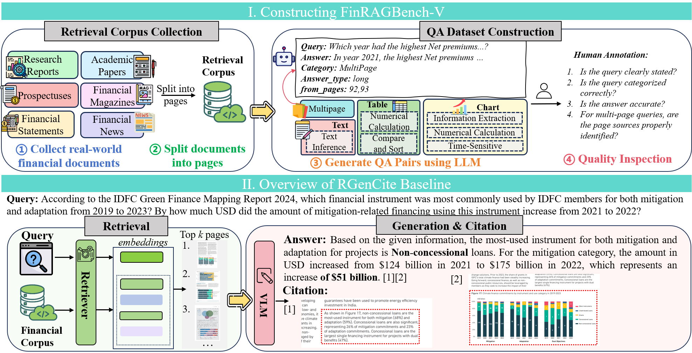

# FinRAGBench-V: A Benchmark for Visual RAG in the Financial Domain

FinRAGBench-V is a **comprehensive benchmark for visual retrieval-augmented generation (RAG) in finance**, addressing the challenge that most existing financial RAG research focuses predominantly on text while overlooking rich visual content in financial documents. By integrating multimodal data and providing **visual citation**, FinRAGBench-V ensures traceability and supports robust evaluation of Multimodal Large Language Models (MLLMs).

🤗 [Dataset](https://huggingface.co/datasets/zsfhhh/FinRAGBench-V) | 📄 [Paper](https://arxiv.org/abs/2505.17471) | 🏠 [Project Page](https://github.com/zhaosuifeng/FinRAGBench-V)

<p align="center">
  
</p>

## Benchmark: FinRAGBench-V

- 📊 **Multimodal Retrieval Corpus:**  We construct a multimodal financial corpus by collecting documents from various real-world financial sources, including research reports, financial statements, prospectuses, academic papers, financial magazines, and financial news. The corpus contains 60,780 Chinese pages and 51,219 English pages from 1,104 Chinese and 1,105 English documents.
  
- 📝 **High-Quality QA Dataset:**  We construct  a high-quality, human-annotated question-answering (QA) dataset spanning heterogeneous data types (charts, tables, and texts) and seven question categories, including time-sensitive, numerical calculations, comparison and sorting, and multi-page queries.

## Baseline: RGenCite

We provide **RGenCite**, a multimodal RAG baseline that seamlessly integrates:

- 🔍 **Retrieval:** Efficiently retrieves relevant textual and visual information from the dataset.  
- ✍️ **Generation:** Produces high-quality answers grounded in retrieved content.  
- 📌 **Fine-Grained Visual Citation:** Provides precise visual evidence (page- and block-level) to support answers.

## Automatic Citation Evaluation

We propose an **automatic evaluation method** for visual citation, which:

- Measures **precision and recall** at multiple citation levels.
- Uses **box-bounding** and **image-cropping** techniques to assess the alignment of cited visual evidence.

## Quick Start

```bash
# Clone the repository
git clone https://github.com/zhaosuifeng/FinRAGBench-V.git
cd FinRAGBench-V

